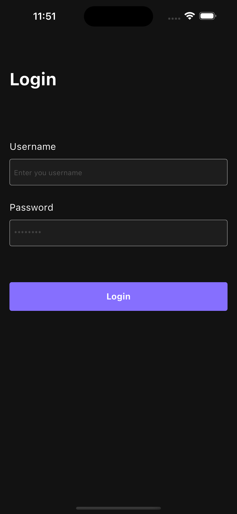
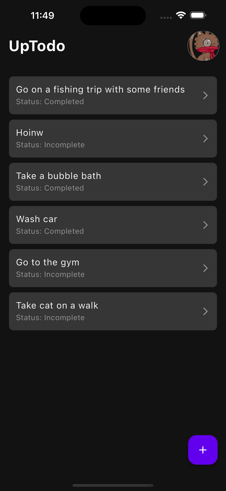
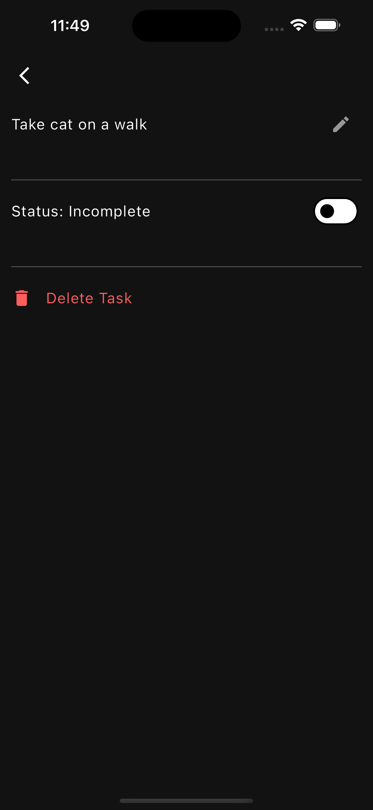

# UpTodo

A task manager app that allows users to manage their tasks efficiently.

## Requirements

_`This project was build with Flutter 3.10.5`_

| Flutter     | Android         | iOS        |
| :---------- | :-------------- | :--------- |
| SDK 3.10.5+ | Android API 21+ | iOS 14+    |
| Dart 3.0.5+ | Java 8+         | Swift 5.3+ |
|             |                 | Xcode 15.x |

### Configuration

- Add Production url at this [config file](lib/core/data/network/config.dart). **kProductionUrl** is string to update.

```dart
const String kProductionUrl = '';
```

### Running the Application

The app is configured to work with different configurations using flavors. i.e. `Production` and `Staging`.

To run the application:

1. Fetch the packages with:

   ```dart
   flutter pub get
   ```

2. Run the application using the following command:
   ```dart
   flutter run --flavor (staging | production)
   ```

## Building the application

You can build the application using the following commands. You can either choose to build the application using different environments. i.e `staging` and `production`

### Android

```bash
flutter build (appbundle | apk) -t lib/main.dart --release --flavor production --dart-define ENVIRONMENT_VAR=PRODUCTION
```

### iOS

```bash
flutter build ios -t lib/main.dart --release --flavor production --dart-define ENVIRONMENT_VAR=PRODUCTION
```

## Screenshots

| **Login Screen**                            | **Home Screen**                             | **Task Detail Screen**                      |
| ------------------------------------------- | ------------------------------------------- | ------------------------------------------- |
|  |  |  |

## Known issues

For locally added taks, they are only saved locally and when a new task is created the task cannot be deleted using API calls. This also happens when adding a new task.

## Contributing

Contributions are welcome.
In case of any problems open an issue.
Create a issue before opening a pull request for non trivial fixes.
In case of trivial fixes open a pull request directly.

## License

[MIT](https://choosealicense.com/licenses/mit/)
